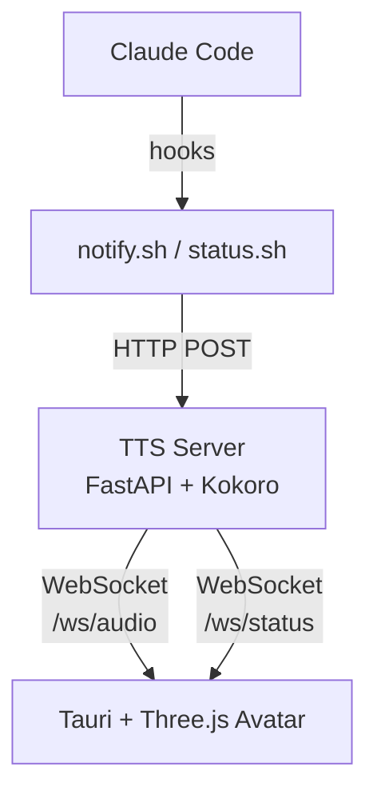

# V1R4

> [!CAUTION]
> Never blindly install AI projects from the internet. Always review the source code and understand what it does before running it on your machine. Proceed at your own risk.

Reading long Claude Code outputs gets exhausting — walls of text, dry eyes, notifications that don't grab your attention. V1R4 gives Claude a face and a voice, so you can hear what it did instead of reading it all. A 3D avatar overlay that speaks responses, tracks your cursor, and reacts with mood-driven expressions — all running locally. For anyone whose workflow lives in Claude Code.

Built with [Claude Code](https://claude.ai/code) (Opus).

https://github.com/user-attachments/assets/5fc1fea1-9b53-4c83-b054-1c533a7c1c5e

## Features

- **Voice** — speaks Claude's responses aloud via local [Kokoro](https://huggingface.co/hexgrad/Kokoro-82M) TTS (no cloud, no API keys)
- **Lipsync** — mouth tracks speech amplitude in real-time
- **Cursor tracking** — eyes follow your mouse across the screen
- **Mood expressions** — reacts to errors, successes, warnings with facial expressions and colored border glow
- **Typing reactions** — subtle head/shoulder movements when you type (macOS)
- **Customizable** — swap avatar models (VRM), voices (27 English options), backgrounds, camera angle

## Prerequisites

- **Node.js** 20.19+ or 22+ (Vite 7 requirement)
- **Rust** 1.86+ (auto-installed via `rust-toolchain.toml` if you have [rustup](https://rustup.rs))
- **Python** 3.10–3.12 with pip
- **GPU** — required for TTS inference
  - macOS: Apple Silicon (MPS)
  - Windows/Linux: NVIDIA GPU with CUDA
- **Claude Code** — the CLI tool ([docs](https://docs.anthropic.com/en/docs/claude-code))

## Setup

```bash
./setup.sh
```

Installs all dependencies, configures Claude Code hooks, and lets you pick a voice and personality. Follow the prompts.

<details>
<summary>Manual setup (without setup.sh)</summary>

```bash
# Frontend + Tauri
npm install

# TTS server
cd server
python -m venv .venv
source .venv/bin/activate  # Windows: .venv\Scripts\activate
pip install -e .
cd ..
```

Configure Claude Code hooks:

- Make hooks executable: `chmod +x server/hooks/notify.sh server/hooks/status.sh`
- Edit `~/.claude/settings.json` and merge the hooks config from `server/hooks/hooks.json.example`, replacing `/ABSOLUTE/PATH/TO/v1r4-avatar` with your actual path.
- Copy `docs/example-claude-md.md` into `~/.claude/CLAUDE.md` to enable TTS voice output.

</details>

## Start

```bash
server/scripts/start.sh --avatar
```

Starts the TTS server and avatar window. First launch downloads the Kokoro TTS model (~350MB). The avatar appears as a transparent overlay — right-click it for options.

```bash
# Stop everything
server/scripts/stop.sh
```

> [!TIP]
> You can also ask Claude Code:
> ```
> read the README and start V1R4 for me
> ```

## Use

Open Claude Code in any project. The avatar will:
- Show a thinking animation when Claude is working
- Speak Claude's response aloud (from the `<tts>` tag)
- React to tool usage with short audio cues
- Track your cursor with eye movement
- Pulse the border based on mood (`error` = red, `success` = purple, `warn` = amber, `melancholy` = blue)

## Platform Notes

| Feature | macOS | Windows | Linux (X11) | Linux (Wayland) |
|---------|-------|---------|-------------|-----------------|
| Avatar + TTS | Yes | Yes | Yes | Yes |
| Cursor tracking | Yes | Yes | Yes | No (eyes centered) |
| Typing detection | Yes | No | No | No |
| Hook scripts | Native bash | WSL | Native bash | Native bash |

## Customization

> [!NOTE]
> Want shorter TTS responses, a different personality, or to change how Claude interacts? You can ask Claude Code directly — it can edit your `~/.claude/CLAUDE.md` for you.

- **Voice personality:** Edit `~/.claude/CLAUDE.md` — the avatar speaks whatever style you define (see `docs/example-claude-md.md`)
- **Avatar model:** Right-click → Load Avatar (`.vrm` files only). Persists across restarts. Right-click → Reset Avatar to revert to default.
- **Background:** Right-click → Background (presets or custom image)
- **Voice:** Right-click → Voice (23 Kokoro voices across American/British, male/female)
- **Camera:** Scroll to zoom (smooth), right-click drag to pan up/down. Also available via right-click → Camera menu.
- **Notification sound:** Right-click → Notification Sound — controls how often the audio cue plays while Claude waits for input (off / once / every 15s / every 30s / always).
- **TTS voice/speed:** Create `server/.env` with `TTS_VOICE=bf_isabella` and `TTS_SPEED=1.1` (see `server/.env.example`)

## How it works

Claude's responses include a hidden `<tts>` tag with a spoken summary — wrapped in an HTML comment so it's invisible in the CLI terminal. The hook scripts extract it and send it to the local TTS server, which streams audio to the avatar.

 



## Uninstall

```bash
./uninstall.sh
```

Interactive script that removes hooks, config, cache, and service files. Shows what will be removed and asks before each destructive step. The project folder itself is not deleted.

> [!TIP]
> You can also ask Claude Code:
> ```
> read the uninstall section in the README and remove V1R4 from my system
> ```

<details>
<summary>Manual uninstall (without uninstall.sh)</summary>

### 1. Stop running processes

```bash
server/scripts/stop.sh
pkill -f "claude_voice.server" 2>/dev/null
```

### 2. Remove Claude Code hooks

Edit `~/.claude/settings.json` and delete the `hooks` entries that reference `v1r4` (the ones pointing to `notify.sh` and `status.sh`). If V1R4 was your only hook user, you can remove the entire `"hooks"` key.

### 3. Clean up TTS personality from CLAUDE.md

Open `~/.claude/CLAUDE.md` and delete everything between `<!-- V1R4-AVATAR-CONFIG-START -->` and `<!-- V1R4-AVATAR-CONFIG-END -->` (inclusive). Your other CLAUDE.md content is untouched.

### 4. Remove config and cache files

```bash
# V1R4 config
rm -rf ~/.config/claude-voice

# Cached TTS audio cues
rm -rf ~/.claude/alert_cache

# Log files (macOS)
rm -f ~/Library/Logs/claude-voice-hook.log
rm -f ~/Library/Logs/claude-voice-tts.log

# Log files (Linux)
rm -f "${XDG_STATE_HOME:-$HOME/.local/state}/claude-voice-hook.log"
rm -f "${XDG_STATE_HOME:-$HOME/.local/state}/claude-voice-tts.log"

# Runtime temp files
rm -rf "${TMPDIR:-/tmp}/v1r4-$(id -u)"
```

### 5. Remove macOS launchd service (if installed)

```bash
server/scripts/uninstall.sh
```

### 6. Remove WebView application data

```bash
# macOS
rm -rf ~/Library/Application\ Support/com.v1r4.avatar

# Linux
rm -rf ~/.config/v1r4-avatar ~/.local/share/v1r4-avatar
```

### 7. Remove large build artifacts (optional)

```bash
# Python venv (~5-6GB)
rm -rf server/.venv

# Rust build cache (~3GB)
rm -rf target

# Kokoro TTS model (~350MB, shared by HuggingFace — only remove if no other project uses it)
rm -rf ~/.cache/huggingface/hub/models--hexgrad--Kokoro-82M
```

### 8. Delete the project

```bash
rm -rf /path/to/v1r4-avatar
```

</details>

## Troubleshooting

- **No speech:** Check that the TTS server is running (`curl http://127.0.0.1:5111/health`)
- **Hooks not firing:** Verify paths in `~/.claude/settings.json` are absolute and scripts are executable
- **No avatar model:** A default model is included — if missing, re-clone or download from [Open Source Avatars](https://www.opensourceavatars.com/)
- **GPU errors:** Check that PyTorch sees your GPU (`python -c "import torch; print(torch.cuda.is_available())"` or `torch.backends.mps.is_available()` on macOS)

## Community

Got an idea, found a bug, or want to show off your avatar? Join the [Discord](https://discord.gg/XMYbNnZN7f). PRs and [issues](../../issues) are welcome.
